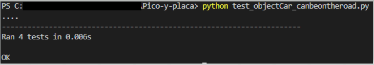
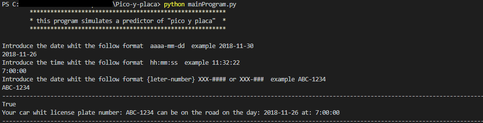

# Pico-y-placa
This application determines whether or not a car should roll down by the street from its license plate number, date and time.

The flowchart of the program will be as follows.

--------------------------------------------------------------------
1 .- You need the installation of python in its version 3.X

2 .- Clone or download the project

3 .- Execute the test 'test_objectCar_canbeontheroad.py'

4.- Execute the main program 'mainProgram.py'
